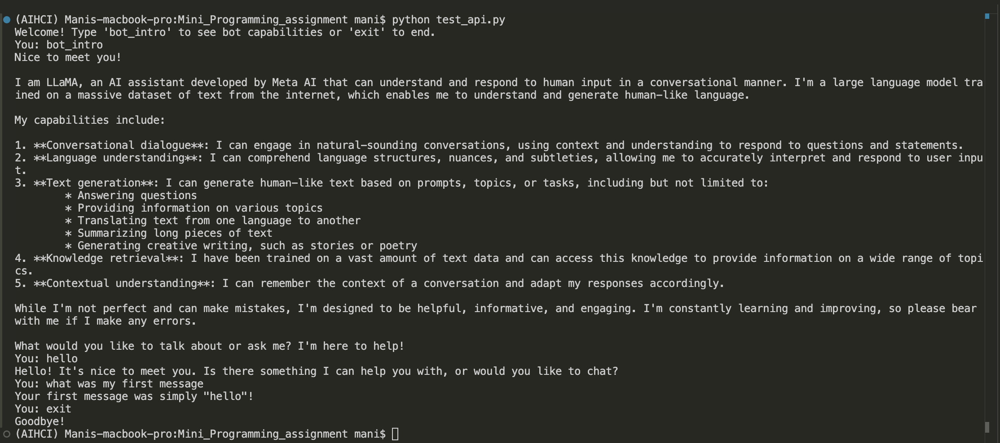

# CS5170_Mini_Programming_Assignment
A repository for demonstrating Llama API usage and learning process by creating a simple chatbot with 30K context memory.

## Llama Language Model usage through GROQ API

In this project, I demonstrate how to use Meta's Llama LLM through the GROQ API platform to create a versatile chatbot system with two distinct functionalities. The code in the chatbot_app.py file sets up:

1)BotIntroduction: A bot that provides a detailed introduction and lists the capabilities of the Llama3-70B model on the GROQ platform, allowing users to understand its various functions.

2)MemoryChatBot: A memory-based chatbot that interacts with users in a continuous conversational style, retaining previous messages for contextually relevant responses.
This project leverages GROQ API, a cost-effective solution for hosting large language models, to deliver responses tailored to user queries. Additionally, the application supports dynamic switching between bots, allowing users to explore model capabilities or engage in an ongoing conversation seamlessly.


To learn more about GROQ API, go here - https://groq.com

## Files Used

1) test_api.py - File to test the API
2) requirements.txt - Contains necessary Python dependencies
3) credentials.env - file to save env variables, including the GROQ API key.

## Dependencies 

 - Python version = 3.10 (provides stable support for GROQ)
 - GROQ API Key - https://console.groq.com/keys (Can be obtained from this link, has a free tier)

## Setup

Initalize a python env with 3.10 version using `conda create -n testenv python=3.10` or any other method of your choice and activate the env. Below is the setup instructions to get the project to run:

Step 1: Clone the repository
```bash
git clone https://github.com/mani2001/CS5170_Mini_Programming_Assignment.git
```

Step 2: Change into the directory
```bash
cd CS5170_Mini_Programming_Assignment/
```

Step 3: Go to credentials.env file and replace with your GROQ API key as - 
```bash
GROQ_API_KEY = "<API_KEY>" #do not use quotes just paste the api key
```

Step 4: Install all the required libraries by using the command - 
```bash
pip install -r requirements.txt
```

Step 5: In the root directory of the project run the following -
```bash
python test_api.py
```
## How It Works (Documentation)

***All necessary comments are given in the code.***

BotIntroduction: This bot answers a preset query, "Hi, who are you and what are your capabilities?", giving users a sense of the model's strengths. This is triggered by the bot_intro command during a chat session.

MemoryChatBot: Retains previous interactions to enable context-based responses. It tracks token usage to ensure the conversation remains within token limits, removing older messages when necessary.


## Code overview

Classes:
`BotIntroduction`: A simple bot that introduces the LLM's capabilities when prompted with bot_intro.

`MemoryChatBot`: A memory-based chatbot that retains context across user inputs, allowing for continuous, context-aware conversations.

Functions:

`BotIntroduction.introduce`: Sends a fixed prompt asking the LLM to introduce itself and describe its capabilities.

`MemoryChatBot.chat`: Adds user input to the conversation context, sends it to the LLM, and prints the response. The function also handles token counting to prevent exceeding the maximum limit.

`MemoryChatBot.add_message` and `count_tokens`: Manages message storage and token tracking to remove the oldest messages when necessary.

## Example input and output




## Reflection

This project provided a hands-on experience with generative AI, focusing on integrating Meta's Llama model through the GROQ API for a dual-function chatbot system. 

**Challenges**: One key challenge was managing conversational memory within token constraints for the `MemoryChatBot`, requiring a method to balance relevance by retaining recent messages while discarding older ones. Additionally, designing two distinct bot functions—one for memory-based interaction and one for model introduction—helped me understand modular bot design and the importance of clear functionality in conversational systems.

**Lessons Learned**: I gained insights into token management, memory handling, and modular bot setups, which are essential for creating responsive, context-aware chatbots. Working with the GROQ API also refined my skills in API integration and secure environment handling, which are crucial for deploying scalable models.

**Future Applications**: With this experience, I’m interested in expanding multi-function bots that support various tasks, such as summarization or customer support. This project has equipped me with a better understanding of user-centered conversational design, which I look forward to applying in more complex AI-driven applications.

