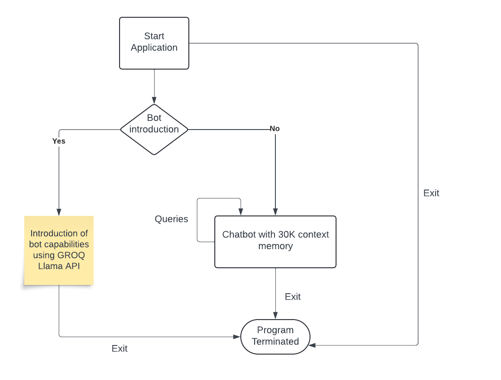

# CS5170_Mini_Programming_Assignment
A repository for demonstrating Llama API usage and learning process

## Llama Language Model usage through GROQ API

In this project, I demonstrate how to use Meta's Llama LLM through the GROQ API platform to create a versatile chatbot system with two distinct functionalities. The code in the chatbot_app.py file sets up: \n

->BotIntroduction: A bot that provides a detailed introduction and lists the capabilities of the Llama3-70B model on the GROQ platform, allowing users to understand its various functions.

->MemoryChatBot: A memory-based chatbot that interacts with users in a continuous conversational style, retaining previous messages for contextually relevant responses.
This project leverages GROQ API, a cost-effective solution for hosting large language models, to deliver responses tailored to user queries. Additionally, the application supports dynamic switching between bots, allowing users to explore model capabilities or engage in an ongoing conversation seamlessly.




## Files Used

1) test_api.py - File to test the API
2) requirements.txt - Contains necessary Python dependencies
3) credentials.env - file to save env variables, including the GROQ API key.

## Dependencies 

 - Python version = 3.10 (provides stable support for GROQ)
 - GROQ API Key - https://console.groq.com/keys

## Setup

Initalize a python env with 3.10 version using conda or any other method of your choice. Below is the setup instructions to get the API to run:

Step 1: Clone the repository
```bash
git clone https://github.com/mani2001/CS5170_Mini_Programming_Assignment.git
```

Step 2: Change into the directory
```bash
cd CS5170_Mini_Programming_Assignment/
```

Step 3: Create a credentials.env file and add the GROQ API key as - 
```bash
GROQ_API_KEY = "<API_KEY>"
```

Step 4: Install all the required libraries by using the command - 
```bash
pip install -r requirements
```

Step 5: In the root directory of the project run the following -
```bash
python test_api.py
```

